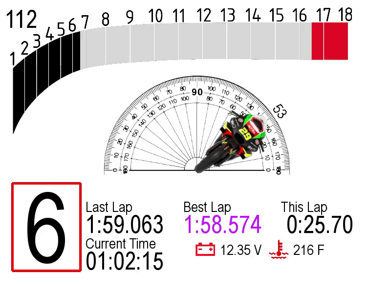

# RaceDash
 GUI Dash that runs on Raspberry Pi 4
 This GUI is based on PyGame and test run shows it can achieve 120 Hz refresh rate on RPI 4, which is more than enough for a race dash. Currently, the dash runs like below (Top left is a FPS counter for debug purposes):
 
 
 
 TODO:
 Add in the UBlox F9p module to obtain centimeter level positioning
 Split wires on motorcycle to read ECU data.
 Vehicle integration and testing on track
